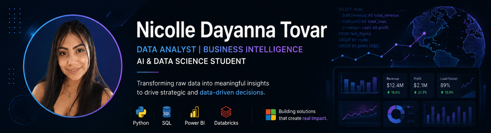

  

# 👋 Hi, I'm Nicolle Dayanna Tovar Rojas

### Data Analyst | Business Intelligence | AI & Data Science Student

I am an **AI & Data Science Engineering student** and a **Software Development Technologist** passionate about transforming data into actionable insights.

My interests include **Business Intelligence, Data Analytics, Data Warehousing, SQL, Python, and Machine Learning**. I enjoy building data-driven solutions that help organizations make better decisions through meaningful analysis and interactive dashboards.

---

## 🚀 About Me

- 🎓 AI & Data Science Engineering Student
- 💼 Software Development Technologist
- 📊 Passionate about Data Analytics and Business Intelligence
- 🗄️ Experienced in Data Warehouse modeling and SQL
- 📈 Interested in Machine Learning and Data Engineering
- 🌱 Currently expanding my knowledge in Databricks and Azure
- 🎯 Seeking opportunities as a Data Analyst or Business Intelligence Analyst

---

## 💻 Tech Stack

### Programming Languages

### Data & BI

### Web Development

### Tools

---

## 📚 Currently Learning

- ☁️ Microsoft Azure
- 📊 Databricks Lakehouse Platform
- 🤖 Machine Learning
- 🏗️ Data Engineering
- 🧠 Deep Learning

---

## 🎯 Career Interests

- Data Analytics
- Business Intelligence
- Machine Learning
- Data Engineering
- Artificial Intelligence

---

## 📫 Connect with Me

💼 **LinkedIn**  
www.linkedin.com/in/nicolle-dayanna-tovar-rojas-8a9a41313

📧 **Email**  
nenillapaz11@gmail.com

---

> *"Turning data into strategic decisions through analytics, technology, and continuous learning."*
<!--
**Nicol-17/Nicol-17** is a ✨ _special_ ✨ repository because its `README.md` (this file) appears on your GitHub profile.

Here are some ideas to get you started:

- 🔭 I’m currently working on ...
- 🌱 I’m currently learning ...
- 👯 I’m looking to collaborate on ...
- 🤔 I’m looking for help with ...
- 💬 Ask me about ...
- 📫 How to reach me: ...
- 😄 Pronouns: ...
- ⚡ Fun fact: ...
-->
